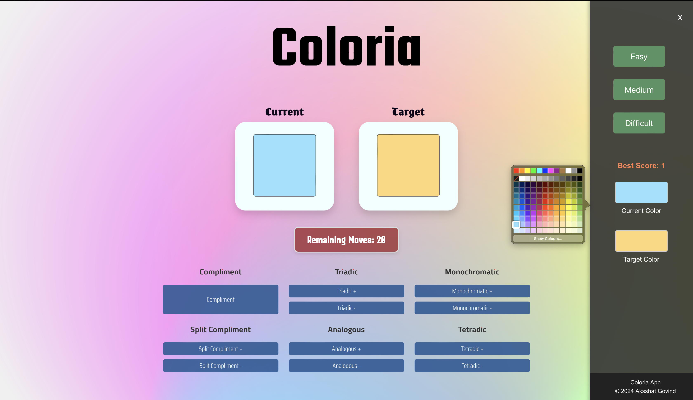

# Coloria

Coloria is a color-based game where users attempt to match a target color through various color manipulations. The game tests color perception and understanding of color theory principles. Players have a limited number of moves to reach the target color from the current color.

## Features

- **Color Matching:** Match the target color using various color adjustment options.
- **Difficulty Levels:** Choose from Easy, Medium, or Difficult modes, each with a different number of allowed moves.
- **Score Tracking:** Track and save the best score based on the difficulty level.
- **Sidebar Options:** Adjust colors and view scores through a sidebar interface.

## Screenshots




## Installation

1. **Clone the Repository:**

    ```bash
    git clone [Repo-URL]
    ```

2. **Navigate to the Project Directory:**

    ```bash
    cd coloria
    ```

3. **Install Dependencies:**

    Ensure you have [Node.js](https://nodejs.org/) installed. Run the following command to install the project dependencies:

    ```bash
    npm install
    ```

## Usage

1. **Start the Development Server:**

    ```bash
    npm start
    ```

    This will open the application in your default web browser. You can interact with the game and access the sidebar to adjust colors and manage difficulty.

2. **Build the Project:**

    To create a production build of the project, run:

    ```bash
    npm run build
    ```

    The build files will be generated in the `build` directory.

## Components

- **App:** The main application component that manages game logic, state, and rendering.
- **ColorCard:** Displays the current and target colors.
- **ColorPicker:** Provides options to adjust the current color.
- **ColorChooser:** Allows users to select colors for current and target using a color picker input.
- **MoveCounter:** Displays the number of remaining moves.
- **Sidebar:** Contains difficulty options, color chooser components, and score information.


## Contributing

Contributions are welcome! If you'd like to contribute to this project, please follow these steps:

1. **Fork the Repository:** Click the "Fork" button at the top right of this page.

2. **Create a New Branch:**

    ```bash
    git checkout -b feature/your-feature
    ```

3. **Make Your Changes:** Implement the desired features or fixes.

4. **Commit Your Changes:**

    ```bash
    git add .
    git commit -m "Add feature: your feature description"
    ```

5. **Push to Your Fork:**

    ```bash
    git push origin feature/your-feature
    ```

6. **Create a Pull Request:** Open a pull request on the main repository to merge your changes.

## License

This project is licensed under the MIT License - see the [LICENSE](/LICENSE) file for details.

## Acknowledgments

- [Chroma.js](https://github.com/gka/chroma.js): For color manipulation.
- [React](https://reactjs.org/): For building the user interface.

---

For more details or questions, please contact [Aksshat Govind](github.com/aksshatgovind).