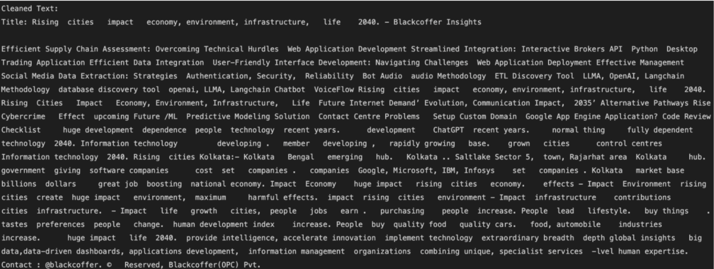

# Data Extraction and NLP

# 1 Methodology
The objective of this project is to extract textual data articles from the given URL and
perform text analysis to compute variables

## 1.1 Data Extraction
The data extraction process begins by utilizing Python libraries such as Pandas, Requests,
BeautifulSoup, and regular expressions. A custom function, extract_article_text(url), is
designed to retrieve articles' title and main text content from URLs. It employs Requests to fetch
webpage data, BeautifulSoup to parse HTML content, and regular expressions to clean extracted
text.

The main function reads input data from an Excel file, iterates over each URL, and invokes the
extraction function. If successful, it writes the extracted content into separate text files, naming
them based on unique identifiers.

Conversely, if extraction fails, an error message is displayed. This automated process efficiently
extracts article data for further analysis, demonstrating the seamless integration of web scraping
techniques within data processing workflows.

## 1.2 Sentiment Analysis and Text Analysis
In the code provided in "utils.py," there are different tools to help understand and analyze text.

1. Cleaning Stopwords: Stopwords are used to clean the text so that Sentiment Analysis
can be performed by excluding the words found in Stopwords list.

2. Sentiment Analysis: This part helps understand the feelings expressed in text. For
example, it can tell if the text sounds positive or negative. It uses lists of words known to
express positive or negative feelings. These lists are checked against the text to calculate
scores that show how positive or negative the text is.

3. Readability Analysis: This part checks how easy or hard the text is to understand. It
looks at things like how long sentences are and how many difficult words there are.

4. Text Analysis: This part looks at various details of the text, like how long words are on
average, how many words are in each sentence, and how many syllables are in each
word.

5. Personal Pronoun Counting: This part counts how often personal pronouns like "I,"
"we," or "us" are used in the text.

For the "Sentiment Analysis", these tools can be used to see if the articles sound positive or
negative. They calculate scores that show how positive or negative the articles are.

In the "Text Analysis", these tools help understand more about the language and structure of the
articles. They can tell things like how easy the articles are to read, how complex the language is,
and who is talking in the articles. This helps understand the articles better and what they're trying
to say.

## 1.3 Extracting Derived Variables
The script "test.py" automates the extraction of various parameters from articles stored as text
files in the "Extracted_Articles" folder. It utilizes utilities from "utils.py" to clean, analyze, and
derive insights from each article.

The script first reads the URL_IDs from the folder, then iterates over each article, extracting
parameters such as positive and negative scores, polarity, subjectivity, readability metrics, and
text details. These parameters are derived using functions from the utilities, including sentiment
analysis, readability analysis, text analysis, and personal pronoun counting.

The resulting data is merged with additional metadata from a CSV file containing URL-related
information. Finally, the extracted parameters are organized into a DataFrame and saved as an
Excel file named "Output Data Structure.xlsx."

This automated process streamlines the extraction of meaningful insights from multiple articles,
facilitating further analysis and interpretation.

# 2 Running the scripts

### Create a Project Directory: 
Create a project directory, and inside add these codes present in the
‘Solution’ folder of drive. Add positive-words.txt, negative-words.txt and Input.xlsx files as
well.

Now, create a folder named ‘Extracted_Articles’ inside the directory for data scraping.

Install Requirements: Install dependencies first

<ul>

    $> pip install -r requirements.txt
</ul>

### Running codes:
1) First run ‘scraper.py’
2) In ‘Extracted_Articles’, you’ll be able to check the text files named by URL_ID.
3) Now, run ‘test.py’

### Final Output: 
After script executes, it will process the articles in the "Extracted_Articles"
folder, extract parameters, merge them with URL data, and save the output in an Excel file
named "Output Data Structure.xlsx" in the same directory.

### Directory Structure: 
It will look like this -

### Manual Test: 
I also have ‘test.ipynb’ which returns all
parameters for a single file only. One can also, replace the
filename to get the desired result.

# 3 Dependency Checklist

### Python: 
Ensure Python is installed on your system. If not, download and install Python from the
official website: Python Downloads. During installation, make sure to check the box that says
"Add Python to PATH."

### Python Libraries: 
Install the necessary Python libraries listed in the "requirements.txt" file. To
install dependencies, navigate to the project directory in the command prompt or terminal and
run the following command:

<ul>

    $> pip install -r requirements.txt
</ul>

<ul>

    beautifulsoup4==4.11.1
    nltk==3.8.1
    openpyxl==3.1.2
    pandas==1.4.3
    regex==2023.10.3
</ul>

This command will automatically install the required libraries and their dependencies.