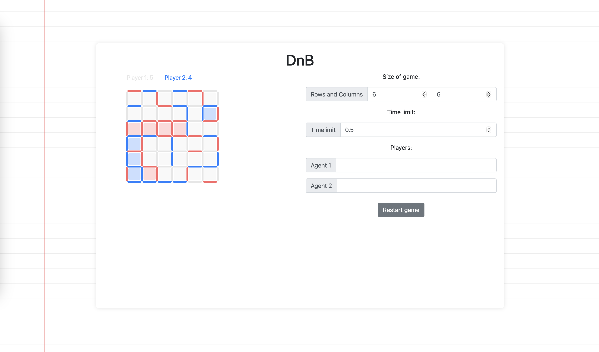

# DnB

## Purpose

The project includes a web-based application for playing Dots and Boxes. It focuses on two-player gameplay where users interact directly with the game board.

## Features

- **Customizable Grid**: Users can specify the number of rows and columns for the game grid.
- **Interactive Gameplay**: Players can click on the grid to draw lines and complete boxes.
- **Game End Detection**: Automatically detects when all boxes are completed and determines the winner.

## Web App

