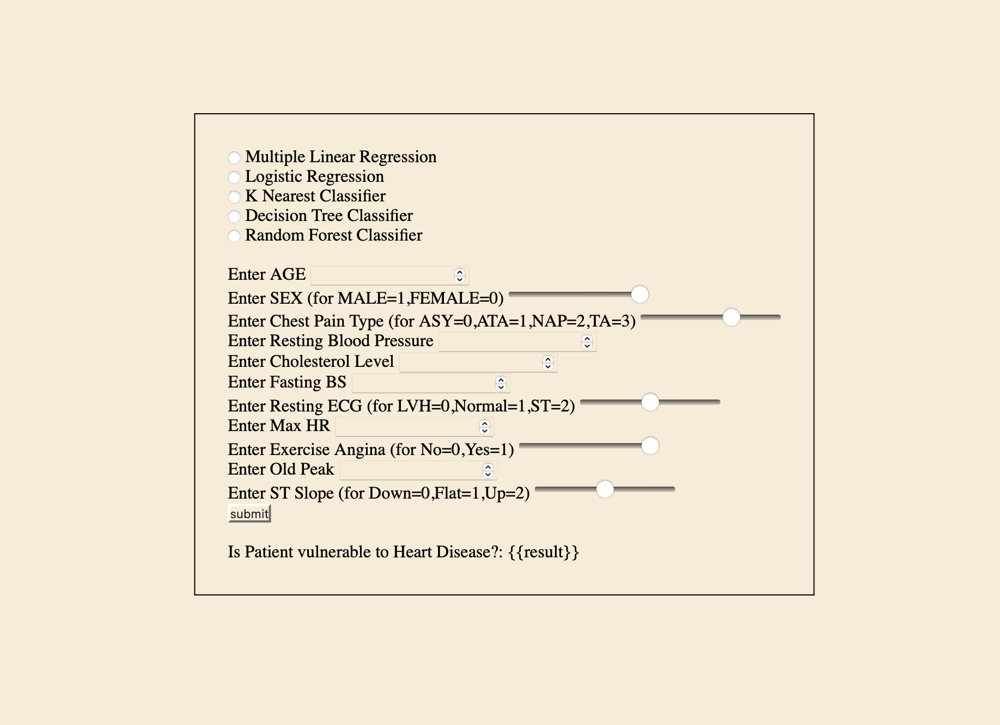

# Heart Disease Prediction Web App

This Flask web application predicts heart diseases using different machine learning models.

## Introduction

The application provides a user-friendly interface where users can input various features related to heart health and select a machine learning model to make predictions.

## Installation

1. Clone the repository:
    ```bash
    git clone https://github.com/aksshatgovind/ML-Projects/tree/main.git
    ```

2. Install required Python packages:
    ```bash
    pip install flask joblib numpy
    ```

## Usage

1. Run the Flask app:
    ```bash
    python App.py
    ```

2. Open your web browser and go to [http://localhost:5000](http://localhost:5000) to access the application.

3. Enter the required information and select a machine learning model from the dropdown menu.

4. Click the "Predict" button to see the prediction result.

## Machine Learning Models

The application uses the following machine learning models for prediction:

- Multiple Linar Regression
- Logistic Regression
- KNN
- ID3
- Random Forest


## File Structure

- `app.py`: Flask application code.
- `web/home.html`: HTML template for the user interface.
- `models/`: Directory containing pre-trained machine learning models.
- `static/`: Directory containing static files.

## Credits

- The machine learning models were trained using data from heart disease datasets.
- Flask is used for building the web application interface.
- Joblib is used for loading pre-trained machine learning models.
- Numpy is used for numerical operations.
