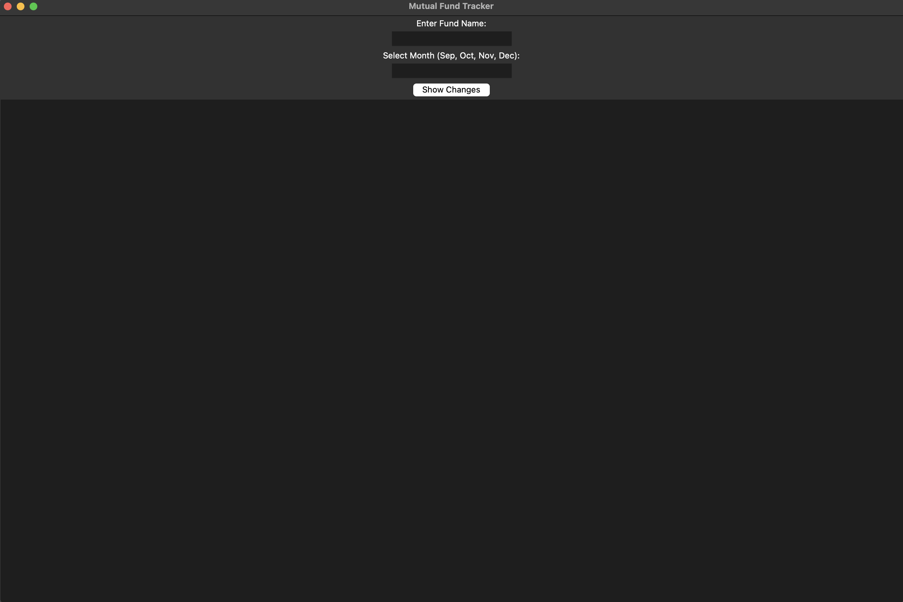
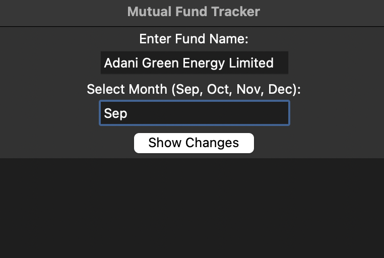
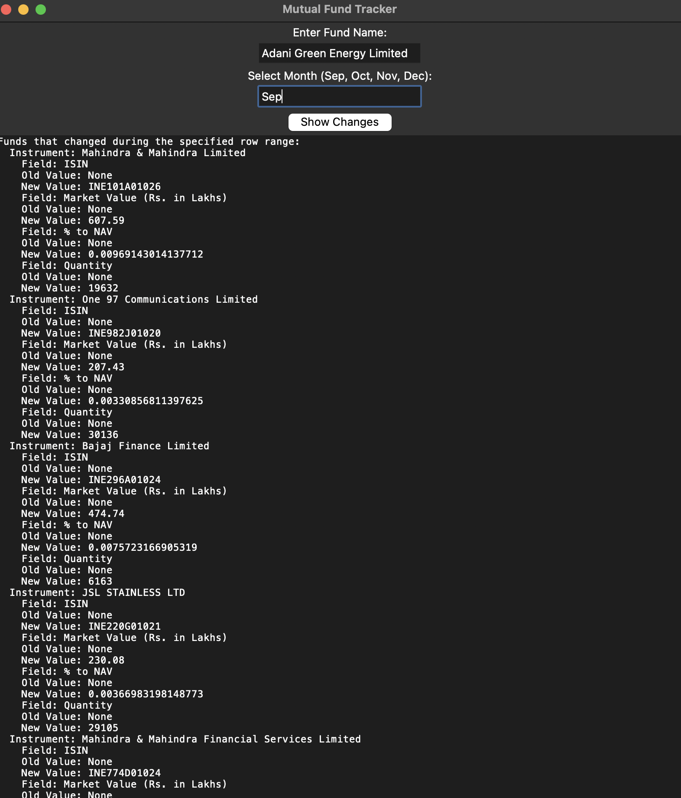

# Mutual Fund Tracker Framework

## Overview

This **Mutual Fund Tracker Framework** allows you to track and manage changes in mutual fund portfolios over time. It parses the data from JSON files, stores the changes, and allows users to filter changes based on specific months (e.g., September, October, November, December). The framework offers a graphical user interface (GUI) built with **Tkinter** to interact with mutual fund data, view the changes made to the portfolios, and display these changes in an easily readable format.

### Features:
- Track and manage mutual fund portfolios.
- View changes over a specific date range (or based on row numbers).
- Split data by month (e.g., September and October).
- Easily add, update, or remove instruments in the portfolio.
- Display a detailed change log in a clean and user-friendly format.

---

## Table of Contents

1. [Installation](#installation)
2. [Usage](#usage)
3. [Framework Design](#framework-design)
4. [Classes and Methods](#classes-and-methods)
5. [Screenshots](#screenshots)

---

## Installation

### Steps

1. Clone the repository.

2. Download your JSON data (e.g., `zn250_sep.json`, `zn250_nov.json`) and place them in the `MFTracker` folder.

---

## Usage

### Running the Application

1. After ensuring your data files are in the `MFTracker` folder, run the application using the following command:

    ```bash
    python MFT.py
    ```

2. This will launch a **Tkinter GUI** that allows you to:

    - Enter the **fund name**.
    - Select the **month** for which you want to see the changes (e.g., "September", "October", "November", "December").
    - View the changes for the selected month.

### User Interaction

- **Enter Fund Name**: Type the name of the mutual fund you want to track.
- **Enter Month**: Input the month for which you want to see the changes (e.g., "Sep", "Oct", "Nov", or "Dec").
- **Click "Show Changes"**: This button will fetch the changes in the mutual fund data for the selected month and display them in the output area.

### Example:
1. **Fund Name**: `Aditya Birla Capital Limited`
2. **Month**: `Sep`
3. **Click "Show Changes"**

The framework will display the changes made to the mutual fund between the rows corresponding to September.

---

## Framework Design

The framework is designed to provide an intuitive and modular approach to managing mutual fund portfolios. Here's a breakdown of the components:

### 1. **MutualFund Class**
   - Responsible for parsing the JSON data and managing the state of the portfolio.
   - Can add, update, or remove instruments from the portfolio.
   - Logs each change with a timestamp and stores a history of changes.
   - Provides methods for calculating the total value of the fund and fetching changes based on row numbers.

### 2. **GUI (Tkinter)**:
   - **Entry Fields**: To input the mutual fund name and month.
   - **Button**: "Show Changes" to display changes for the selected period.
   - **Text Box**: To display the detailed changes made to the mutual fund portfolio.
   - **Event Handlers**: Handle button clicks and fetch changes based on user input.

---

## Screenshots

### 1. **Input:**

The user is prompted to enter the **Fund Name** and **Month**.

  

### 2. **After Clicking "Show Changes":**

Once the user selects the month and clicks "Show Changes", a detailed list of changes will appear below.

  

### 3. **Output:**

An example of how the mutual fund changes for the selected month (e.g., September) appear in the output area.

  

