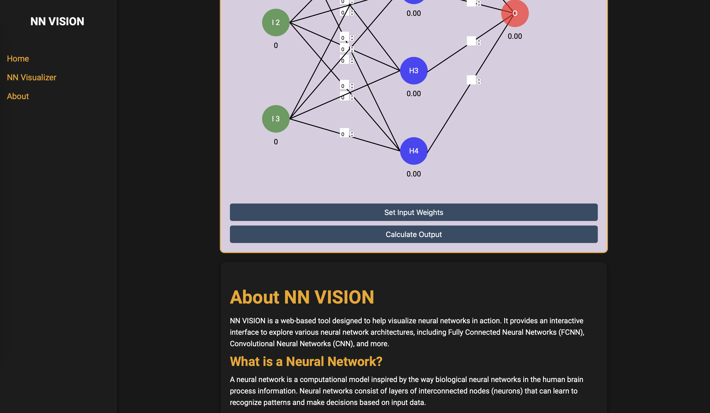

# NN VISION

## Description
**NN VISION** is a web application that allows users to visualize the structure of neural networks. It provides a user-friendly interface to interactively explore different network architectures, layer configurations, and activation functions. With this tool, users can gain a deeper understanding of how neural networks operate and how changes in architecture can affect their performance.

## Features
- **Visualize Neural Networks**: Display the structure of a neural network with customizable layers.
- **Interactive Configuration**: Show the number of neurons in each layer and the activation function used.
- **User-Friendly Interface**: Easy-to-use interface for selecting architectures, inputting values, and viewing results.
- **Real-Time Calculations**: Calculate hidden and output node values instantly.
- **Responsive Design**: Seamless viewing on different devices, ensuring accessibility for all users.

## Installation

1. Clone the repository to your local machine:
    ```bash
    git clone https://github.com/aksshatgovind/ML-Projects/tree/main/NN%20VISION.git
    ```
    
2. Navigate to the project directory:
    ```bash
    cd NN_VISION
    ```
    
3. Install dependencies:
    ```bash
    npm install
    ```

## Usage

1. Start the development server:
    ```bash
    npm start
    ```
    
2. Open your web browser and go to `http://localhost:3000`.
3. Interact with **NN VISION** to explore different configurations and visualize how data flows through the neural network.

## Working

1. **Input Node Values**: Enter values for the input nodes and calculate hidden node values.
   

2. **Calculate Output Value**: After entering input values, calculate the output value of the neural network.
   

3. **About Section**: Learn more about neural networks, their types, and applications in the about section of the application.
   

## Technologies Used
- **React**: For building the user interface.
- **D3.js**: For visualizing the neural network structure.
- **CSS**: For styling the application and ensuring responsive design.

## Contributing
Contributions are welcome! If you have suggestions for improvements or new features, feel free to submit a pull request.


