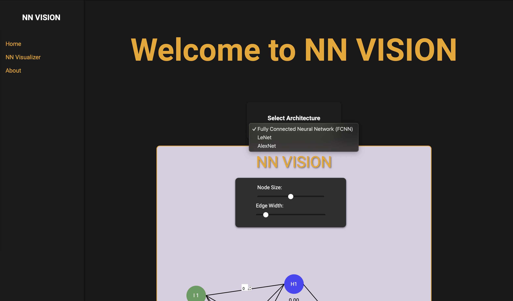
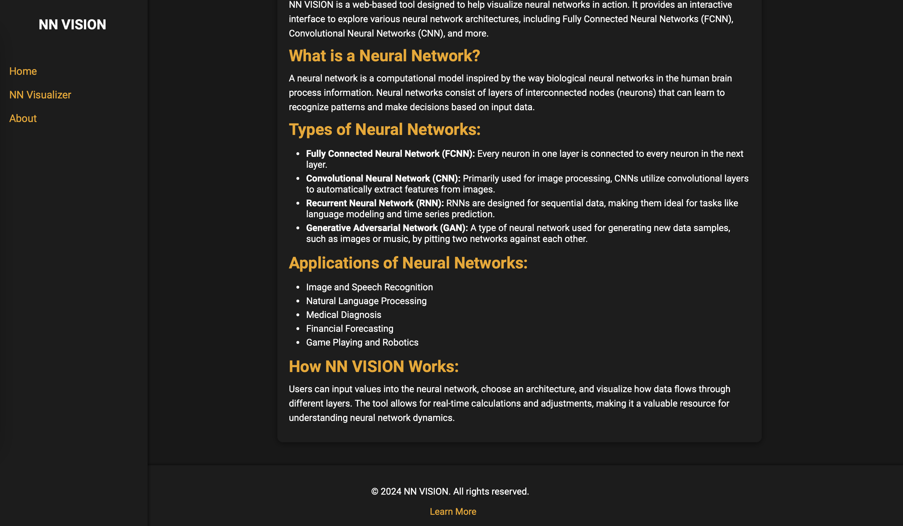

# NN VISION

## Description
NN VISION is a web application that allows users to visualize the structure of neural networks. It provides a user-friendly interface to interactively explore different network architectures, layer configurations, and activation functions.

## Features
- Display the structure of a neural network with customizable layers.
- Show the number of neurons in each layer and the activation function used.
- Easy-to-use interface for adding, removing, and editing layers.
- Responsive design for seamless viewing on different devices.

## Installation

1.  Clone the repository to your local machine:
    
    ```bash
    git clone <repository-url>
    ```
    
2.  Navigate to the project directory:
    
    ```bash
    cd NN_VISION
    ```
    
3.  Install dependencies:
    
    ```bash
    npm install
    ```

## Usage

1.  Start the development server:
    
    ```bash
    npm start
    ```
    
2.  Open your web browser and go to `http://localhost:3000`.
3.  Interact with NN VISION to explore different configurations.


## Working

1. Enter Input Node values and calculate Hidden Node values

 
 

2. Calculate Output Value

 
