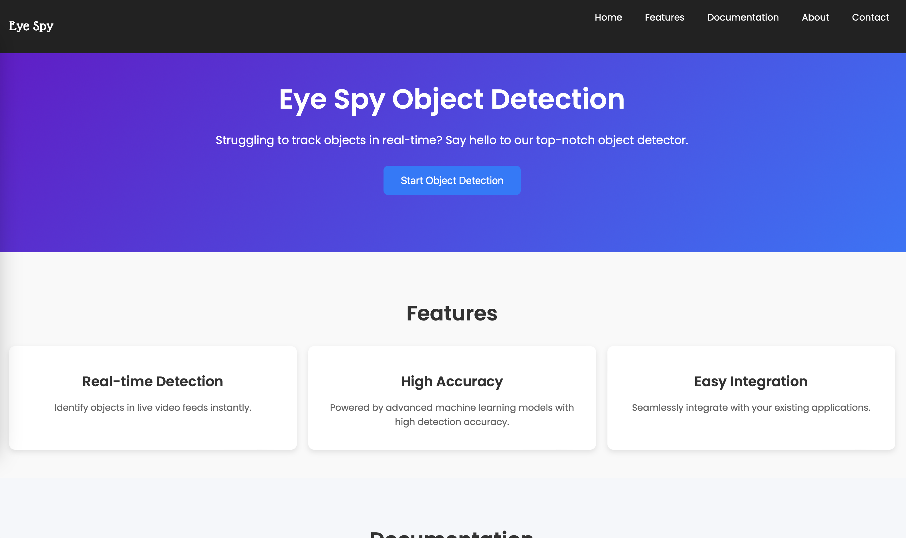
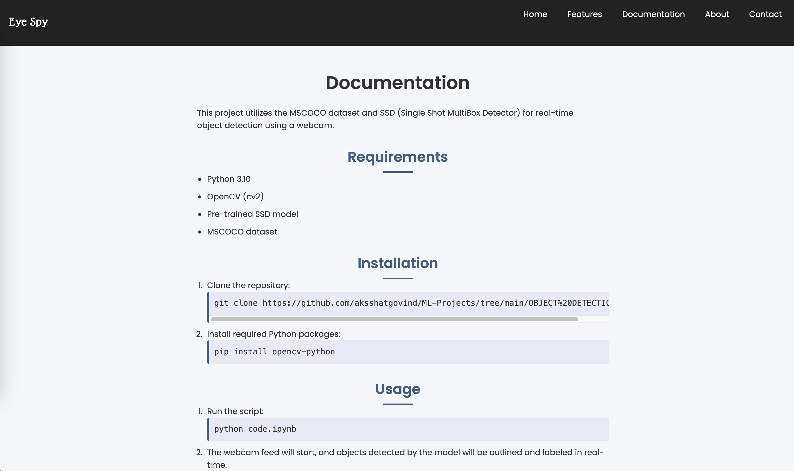

# Real time Object Detection

This project utilizes the MSCOCO dataset and SSD (Single Shot MultiBox Detector) for real-time object detection using a webcam.

## Requirements

- Python 3.10
- OpenCV (cv2)
- Pre-trained SSD model
- MSCOCO dataset

## Installation

1. Clone the repository:
    ```bash
    git clone https://github.com/aksshatgovind/ML-Projects/tree/main/OBJECT%20DETECTION.git
    ```

2. Install required Python packages:
    ```bash
    pip install opencv-python
    ```

## Usage

1. Run the script:
    ```bash
    python code.ipynb
    ```

2. The webcam feed will start, and objects detected by the model will be outlined and labeled in real-time.

3. Press 'q' to exit the application.

## Notes

- Ensure that the webcam is connected and accessible.
- Adjust the confidence threshold (`confThreshold`) as needed for your application.
- The script currently supports detecting up to 80 classes defined in the MSCOCO dataset.

## Website

Here are some snippets of a website I used this OD code for:





