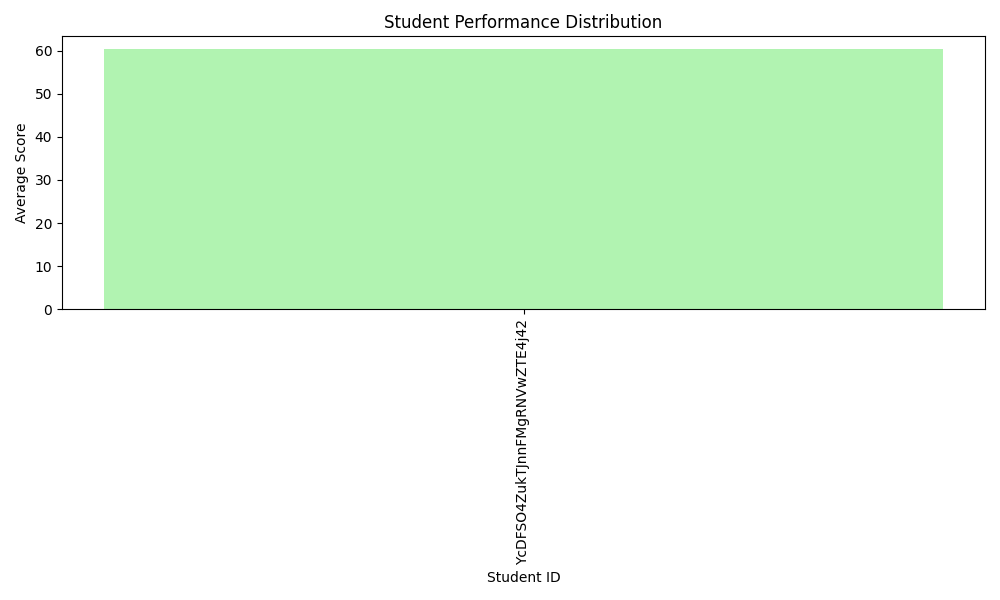
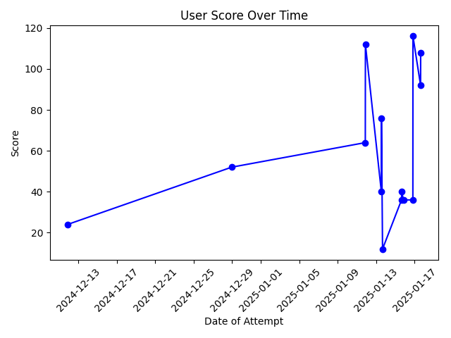

# Quiz Analyst

## Project Overview
The **Quiz Analyst** project is designed to analyze quiz performance and provide personalized recommendations to help students improve their preparation. The project uses two datasets:
- **Current Quiz Data**: Details of a user's latest quiz submission.
- **Historical Quiz Data**: Performance data from the last 5 quizzes.

## Features
- **Quiz Performance Analysis**: Analyze quiz performance by topics, difficulty levels, and question types.
- **Student Personas**: Generate personalized student personas based on their learning patterns and quiz history.
- **Recommendations**: Provide personalized recommendations to students for areas of improvement.
- **Misconceptions Detection**: Identify common misconceptions or weak areas based on the student’s performance.
- **PDF Report Generation**: A comprehensive report that includes analysis results, personalized recommendations, and student persona information in a downloadable PDF format.

## Approach
1. **Data Preprocessing**: Load and preprocess the current and historical quiz data.
2. **Performance Analysis**: Track performance by topics, identify weak areas, and highlight misconceptions.
3. **Personalized Recommendations**: Generate actionable recommendations based on student performance.
4. **Student Persona Creation**: Categorize students into different personas based on their quiz performance (e.g., Top Performers, Improvers, Struggling Learners).
5. **Report Generation**: Generate a PDF report that includes images of analysis and detailed results.

## Output

### Visualizations
- Performance trends and weaknesses are visualized and saved as PNG images in the `images/` folder. These include graphs and charts showing quiz performance over time, strengths, and weaknesses.

### Recommendations
- Personalized recommendations for students will be printed in the console, based on their quiz performance and identified weak areas.

### Report PDF
- A PDF report is generated, which includes:
    - **Student Persona Information**
    - **Personalized Recommendations**
    - **Question Focus and Misconceptions**
    - **Visualizations of performance trends** (e.g., graphs and images from the analysis)
  
You can find the generated PDF report in the `reports/` folder, and you can view all analysis images in the `images/` folder.

---

## Generated Files

### Visualizations

* The analysis results are saved as PNG images in the `images/` folder. These include graphical representations of quiz performance, student weaknesses, and common misconceptions.

**Example of Visualizations:**

- 
- 

> You can replace the above image filenames with the actual names of the images stored in your `images/` folder.

### Report PDF

* A comprehensive PDF report is generated with the title **Quiz Analyst Report** and is available for download in the `reports/` folder.

**Example:**

- [Download the Quiz Analyst Report PDF](reports/Quiz_Analyst_Report.pdf)

### Video Demostration

> Here is a video demostration for this script: [Demo](https://www.loom.com/share/889529746f2e4bbcbd312dddb923969e?sid=945a5baa-3c38-41d1-8b90-f3ae16dd2daf)

---

For more details or questions, please contact [Aksshat Govind](github.com/aksshatgovind).